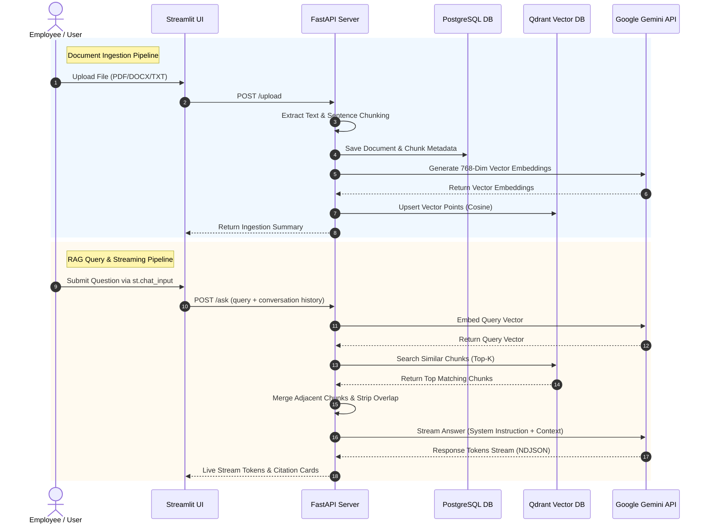

# 🧠 KnowledgeFlow AI

<p align="center">
  
  
  
  
  
  
  
  
  
</p>

KnowledgeFlow AI is an enterprise-grade **Retrieval-Augmented Generation (RAG)** knowledge assistant designed to convert internal company documentation into a secure, conversational, and citation-backed source of truth. Built with a high-performance Python tech stack (**FastAPI**, **Streamlit**, **Qdrant**, **PostgreSQL**, and **Google Gemini API**), KnowledgeFlow AI enables employees to upload multi-format documents, ask natural language questions, and receive grounded answers with exact source citations and real-time token streaming.

---

## ✨ Capability & Feature Matrix

| Feature | Technical Implementation | Enterprise Benefit |
| :--- | :--- | :--- |
| **Multi-Format Ingestion** | `pypdf`, `python-docx`, `txt` extractors | Ingest contracts, resumes, PRDs, and internal notes effortlessly |
| **Sentence-Aware Chunking** | Overlapping windowing (~1000 char window / 200 overlap) | Preserves semantic integrity across sentence boundaries |
| **768-Dim Vector Embeddings** | Google Gen AI SDK (`gemini-embedding-001`) | High-accuracy document chunk representations optimized for retrieval |
| **HNSW Vector Database** | Qdrant (`v1.13.0`) HNSW Cosine Indexing | Sub-millisecond similarity search across indexed document spaces |
| **Relational Metadata** | PostgreSQL (`v17`) & SQLAlchemy ORM | ACID-compliant tracking of documents, page counts, and character offsets |
| **Grounded Answer Synthesis** | `gemini-3.6-flash` + Native System Instruction | Grounded, accurate answers that strictly eliminate hallucinations |
| **Expandable Citation Cards** | Interactive Streamlit cards with percentage match | Transparent citation linking answers directly back to exact source text |
| **Real-Time Token Streaming** | FastAPI `StreamingResponse` (NDJSON) + `st.write_stream` | Instant response feedback with sub-second Time-To-First-Token (~0.8s) |
| **Resilient Error Handling** | Pre-stream socket guard & HTTP 429 rate limit handlers | Prevents socket drops and presents human-friendly status banners |
| **Full Document Management** | Delete document, refresh list, bulk delete endpoints | Complete control over stored files, PostgreSQL metadata, and Qdrant vectors |

---

## 🛠️ Architecture & Pipeline Flow



---

## 📸 Visual Showcase

Explore screenshot walkthroughs and asset guidelines in [docs/SCREENSHOTS.md](docs/SCREENSHOTS.md).

| ChatGPT-Style Chat Interface | Professional Citation Cards |
| :---: | :---: |
|  |  |

| Sidebar Document Management | Real-Time Upload Progress |
| :---: | :---: |
|  |  |

---

## 💻 Tech Stack & Dependencies

- **Backend**: Python 3.10+, FastAPI, Uvicorn, SQLAlchemy ORM, Pydantic
- **Frontend**: Streamlit, Pandas
- **Vector Database**: Qdrant Vector Database (`v1.13.0`)
- **Relational Database**: PostgreSQL (`v17`)
- **AI Engine**: Google Gen AI SDK (`google-genai`)
- **AI Models**: `gemini-3.6-flash` (RAG Generation), `gemini-embedding-001` (Embeddings)
- **Infrastructure**: Docker & Docker Compose

---

## 🚀 Quickstart Guide

### 1. Prerequisites
- Docker Desktop installed and running.
- Python 3.10+ installed.
- A Google Gemini API Key ([Get API Key](https://ai.google.dev/)).

### 2. Environment Setup
Clone the repository and set up environment variables:
```bash
cp .env.example .env
```
Edit `.env` and set your `GEMINI_API_KEY`:
```env
GEMINI_API_KEY=your_actual_gemini_api_key_here
CHAT_MODEL=gemini-3.6-flash
EMBEDDING_MODEL=gemini-embedding-001
```

### 3. Launch Docker Infrastructure
Start PostgreSQL and Qdrant vector database:
```bash
docker compose up -d
```
- **PostgreSQL**: `localhost:5432`
- **Qdrant Dashboard**: `http://localhost:6333/dashboard`

### 4. Install Dependencies
```bash
python -m venv .venv
# On Windows:
.\.venv\Scripts\Activate.ps1
# On Linux/macOS:
source .venv/bin/activate

pip install -r requirements.txt
```

### 5. Launch Application
Terminal 1 (Backend Server):
```bash
uvicorn backend.main:app --reload
```

Terminal 2 (Streamlit UI):
```bash
streamlit run frontend/app.py
```
Open your browser to `http://localhost:8501`.

---

## 🧪 Testing

Run the automated Pytest suite:
```bash
pytest tests/
```

---

## 📚 Technical Documentation

- [docs/PROJECT_STATE.md](docs/PROJECT_STATE.md) — Comprehensive technical architecture & current state.
- [docs/SCREENSHOTS.md](docs/SCREENSHOTS.md) — Visual showcase & screenshot asset guide.
- [docs/Vision.md](docs/Vision.md) — Product vision and goals.
- [docs/Architecture.md](docs/Architecture.md) — Technical component design.
- [docs/Decisions.md](docs/Decisions.md) — Architectural Decision Records (ADR).
